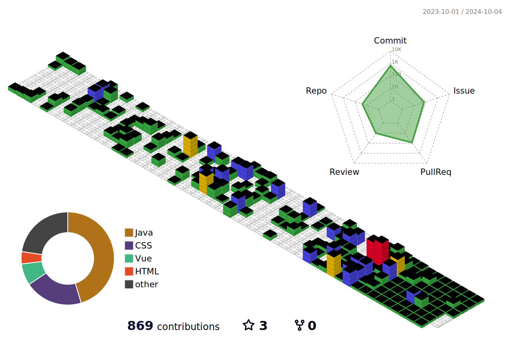

 

  

 

    

### ⛓️ Profile
#### 📍based in Seoul

 2019.02 ~ 2024.8 성신여자대학교 컴퓨터공학과 
 
 2022.11.01. ~ 2022.11.30  SW021(소프트웨어 제로투원) 취업과정 - 데이터 분석 트랙

 2023.02 ~ 2023. 06 Portugal Polytechnic ISEP 교환학생 파견 🇵🇹

 2023.10 ~ 2024.4 한화 시스템 SW 부트 캠프 BEYOND 2기 

---

<!-- -  🔭 I’m currently working on ...
- 🌱 I’m currently learning ...
- 👯 I’m looking to collaborate on ...
- 🤔 I’m looking for help with ...
- 💬 Ask me about ... -->

### 🎱 Skills
<h4> Backend</h4>

    
    
    
    
    
    
    
    
    	

<h4>Frontend</h4>

    
    
    
    
    
    
     
    
    
    
    
    

<h4>Database</h4>

    

<h4>CI/CD</h4>

    
    
    

### 🥇 Backjoon Tier

 

### 🔗 Tech Blog

https://xoxoxoxox.tistory.com/

### 📩 How to reach me | ☕ Coffee Chat | 🫀 Contact Me! 
songyeon0607@naver.com

### :accessibility: More about ME

-  ENFP
-   25
-   인간 또한 자연의 일부로, 모든 일이 자연스럽다
-  🎾🏋🏻‍♀️🎧 ✈️
-  🇵🇹 🇪🇸 🇭🇺 🇮🇹 🇨🇭 🇫🇷 🇬🇧 🇵🇭 🇻🇳

